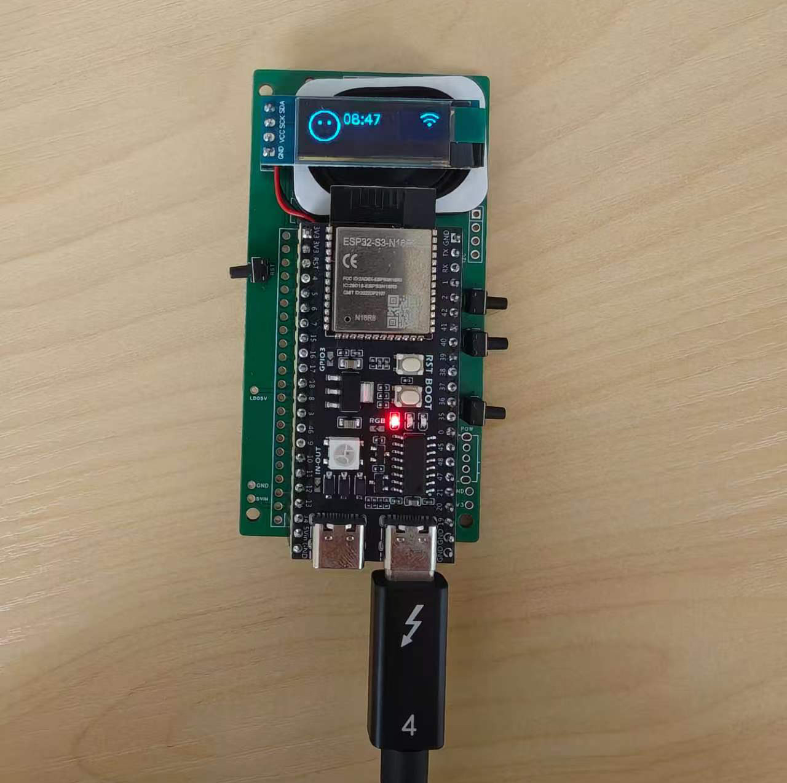
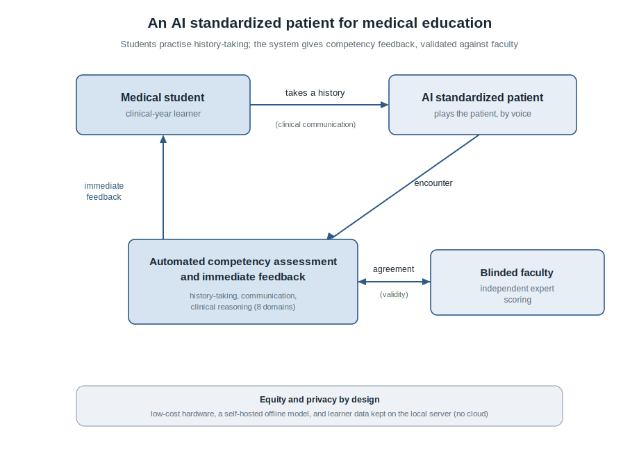

<div align="center">

# AIVMT (AI Vitual Medical Teacher)
### A Low-Cost Embodied Standardized Patient for Medical Education

An open, self-hosted voice **standardized patient (SP)** on a **≈US$15–20 ESP32-S3** device: a student
takes a clinical history out loud, a self-hosted **open-weight LLM** plays the patient *and*
**automatically scores** the encounter, and the scores are **validated against faculty**.



Research artifact for a manuscript submitted to the *npj Digital Medicine* collection<br>
**[Transforming Medical Education through Artificial Intelligence](https://www.nature.com/collections/ehadbhgiji)**.

</div>

---

## Highlights

- 🩺 **Faculty-validated.** The automated *overall* competency score agrees with the blinded
  3-faculty consensus at **ICC(2,1) = 0.903** (95% CI 0.737–0.958), against an inter-faculty ceiling
  of 0.765 (n = 33 encounters, 3 OB/GYN faculty).
- 💵 **Ultra-low-cost & embodied.** Runs on a ≈US$15–20 ESP32-S3 — designed for **LMIC /
  resource-limited** medical schools, where human SPs and faculty grading time are the bottleneck.
- 🔒 **Self-hosted & local-first.** Voice activity detection, speech recognition, and the patient LLM
  all run on your LAN; the device has no cloud fallback.
- 🔁 **Reproducible by construction.** Every reported number traces to a registered artifact under
  [`results/`](results/); a frozen evaluation set and [`check_science.sh`](check_science.sh) guard
  against metric drift.

<sub>Contents:
[Overview](#overview) ·
[Deployment](#deployment) ·
[Results](#results) ·
[Reproducibility](#reproducibility) ·
[Data and code availability](#data-and-code-availability) ·
[Reporting and ethics](#reporting-and-ethics) ·
[Citation](#citation)</sub>

---

## Overview

A student presses the device's **BOOT** button and asks the patient a question (the on-device
front-end is **VAD-only — no wake word**). Audio streams over Wi-Fi to a **self-hosted server**, where
**FunASR** transcribes it, an **Ollama** open-weight model answers *in character* as the patient, and
**TTS** speaks the reply back. A **1-second long-press** exports the transcript + telemetry to the
server's `POST /aivmt/encounter` endpoint, which stores a de-identified encounter. The
**analysis layer** then scores that encounter (history checklist + SEGUE communication + out-loud
reasoning) into a `CompetencyScore` + `Feedback`, and the validation harness compares the scores
against blinded faculty ratings.

<p align="center">
  
</p>

AIVMT is delivered as **three tracks**, each our own code built on an open-source base:

| Track | Our code (in this repo) | Base (referenced, not redistributed) |
|---|---|---|
| **Infrastructure** — server | [`firmware/server_patches/`](firmware/server_patches/) (the `/aivmt/encounter` endpoint) | [xiaozhi-esp32-server](https://github.com/xinnan-tech/xiaozhi-esp32-server) |
| **Firmware** — device | [`firmware/components/aivmt_sp/`](firmware/components/aivmt_sp/) + [`firmware/main_patches/`](firmware/main_patches/) | [xiaozhi-esp32](https://github.com/78/xiaozhi-esp32) |
| **Software** — analysis | [`src/aivmt/`](src/aivmt/) + [`harness/`](harness/) | — |

---

## Deployment

Stand the tracks up in order: **Infrastructure → Firmware → Software.** Prerequisites: `git`, a
machine on the same **LAN** as the device, and [`uv`](https://docs.astral.sh/uv/) for the analysis
tools. Each track below is self-contained — expand it for copy-paste steps.

<details>
<summary><b>② Infrastructure — the self-hosted server</b> (deploy first) · full guide: <a href="docs/SERVER.md">docs/SERVER.md</a></summary>

<br>

VAD + ASR + the patient LLM run locally; the server exposes the encounter endpoint.

```bash
# 0. Clone THIS repo first — our additions live here. Call its path $AIVMT:
#    git clone https://github.com/chenpg2/aivmt.git && export AIVMT="$PWD/aivmt"

# 1. Clone the upstream server, then add our /aivmt/encounter endpoint
git clone https://github.com/xinnan-tech/xiaozhi-esp32-server.git
cd xiaozhi-esp32-server
cp "$AIVMT/firmware/server_patches/aivmt_handler.py" main/xiaozhi-server/core/api/
git apply "$AIVMT/firmware/server_patches/http_server.route.patch"
cd main/xiaozhi-server

# 2. Python 3.10 environment + dependencies
python3.10 -m venv .venv && source .venv/bin/activate
pip install -r requirements.txt

# 3. Install Ollama and pull the local patient model
ollama pull qwen2.5:14b

# 4. Keep it LOCAL: data/.config.yaml selects the Ollama LLM (else the base config uses a CLOUD model)
mkdir -p data
cat > data/.config.yaml <<'YAML'
selected_module:
  LLM: OllamaLLM
LLM:
  OllamaLLM: { type: ollama, model_name: qwen2.5:14b, base_url: http://localhost:11434 }
YAML

# 5. Run it → WebSocket :8000, HTTP :8003 (POST /aivmt/encounter)
python app.py
```

The device points at `http://<SERVER_LAN_IP>:8003`. For **fully offline** operation, select the
local **Piper** TTS provider (`firmware/server_patches/tts_piper.py`; set `selected_module.TTS:
PiperTTS`) instead of the cloud EdgeTTS default — then no component of the loop calls an external
service (FunASR ASR → Ollama LLM → Piper TTS, all on the host). See
[firmware/server_patches/tts_piper.README.md](firmware/server_patches/tts_piper.README.md).

</details>

<details>
<summary><b>① Firmware — flash the device</b> · runbook: <a href="firmware/FLASH_AND_QA.md">FLASH_AND_QA.md</a> · integration: <a href="firmware/INTEGRATION.md">INTEGRATION.md</a></summary>

<br>

The device firmware is the `aivmt_sp` component plus an integration patch applied to the upstream
base. Hardware (board, BOM, wiring, rollback): [docs/HARDWARE.md](docs/HARDWARE.md).

```bash
# ($AIVMT = your clone of THIS repo). Install ESP-IDF v5.5.2 and source it:
. $HOME/esp/esp-idf/export.sh

# Clone the upstream base, drop in our component, apply our integration patch
git clone --recursive https://github.com/78/xiaozhi-esp32.git
cd xiaozhi-esp32
cp -r "$AIVMT/firmware/components/aivmt_sp" components/
git apply "$AIVMT/firmware/main_patches/application.integration.patch"

# Target, configure the server URL, build + flash
idf.py set-target esp32s3
idf.py menuconfig    # CONFIG_AIVMT_ENCOUNTER_POST_URL = http://<SERVER_LAN_IP>:8003/aivmt/encounter
idf.py build flash monitor -p /dev/cu.usbserial-XXXX
```

On the device: **short BOOT click = talk** (VAD, no wake word), **1-second long-press = export**.

</details>

<details>
<summary><b>③ Supporting software — author cases, score, validate</b> · guides: <a href="docs/USAGE.md">USAGE.md</a>, <a href="docs/FACULTY_SCORING.md">FACULTY_SCORING.md</a></summary>

<br>

```bash
git clone https://github.com/chenpg2/aivmt.git && cd aivmt
uv sync --extra dev
uv run --extra dev pytest                                          # mock-LLM tests (no model/hardware)

uv run --extra portal python -m aivmt.portal --port 8765          # author a clinical case
uv run --extra portal python -m aivmt.faculty_portal --port 8770  # blinded faculty scoring portal
uv run --extra serve  python -m aivmt.session --case obgyn_ectopic_zh_01 --id demo01   # run an encounter
```

Encounters are scored into a `CompetencyScore` + `Feedback`; faculty ratings feed the validation
harness. See [docs/USAGE.md](docs/USAGE.md) for the case schema and persona knobs (specialty /
difficulty / disclosure / emotion / language).

</details>

---

## Results

Automated overall score vs. blinded faculty **consensus** (n = 33 complete-case encounters, 3 OB/GYN
faculty, seed 42). Full table: [`results/phase_scoring_validity/summary.md`](results/phase_scoring_validity/summary.md).

| Measure | Value (95% CI) |
|---|---|
| **Overall — system vs faculty consensus, ICC(2,1)** | **0.903 (0.737–0.958)** |
| Overall ICC(2,k) | 0.949 (0.849–0.979) |
| Inter-faculty ceiling, ICC(2,1) | 0.765 (0.533–0.884) |
| History completion, ICC(2,1) | 0.931 (0.826–0.969) |
| End-encounter, ICC(2,1) | 0.889 (0.573–0.959) |
| Bland–Altman bias (system − consensus) | −0.054, LoA [−0.228, 0.120] |

Communication sub-domains and out-loud *reasoning* are reported transparently as weaker (see the
summary); the pre-specified primary endpoint is overall competency agreement.

---

## Reproducibility

- **Numbers ↔ artifacts.** Every value in [`paper/`](paper/) resolves to a registered artifact under
  [`results/`](results/); [`check_science.sh`](check_science.sh) fails the build otherwise.
- **Frozen evaluation set.** The scoring set is frozen and guarded so it cannot drift mid-study.
- **Seeded.** Analyses run under a fixed seed (42).
- **Validation harness.** [`harness/`](harness/) defines the metric phases (ICC / QWK /
  Bland–Altman / G-theory) and their contracts.

<details>
<summary>Repository layout</summary>

```
aivmt/
├── docs/                     English guides (SERVER · HARDWARE · USAGE · FACULTY_SCORING) + architecture.svg + demo.jpg
├── firmware/                 aivmt_sp ESP-IDF component + integration / server patches + flash & QA runbook
├── src/aivmt/                scoring, case schema, persona, case-authoring + faculty portals
├── harness/                  validation phases + contracts + evidence table
├── conf/  configs/           Hydra configs (cases, models, scorers)
├── data/                     SYNTHETIC evaluation apparatus only (real study data is git-ignored)
├── results/                  registered metric artifacts (every paper number traces here)
├── paper/                    IMRAD manuscript skeleton
├── plan/                     protocol · pre-registration · TRIPOD-LLM checklist · study instruments
├── scripts/  tests/          tooling + test suite
└── check_science.sh          governance gate (numbers ↔ artifacts; frozen eval set)
```

</details>

---

## Data and code availability

- **Code.** All system code — the `aivmt_sp` firmware layer, the `/aivmt/encounter` server endpoint,
  the scoring pipeline, and the validation harness — is in this repository. It is **private pending
  publication** and will be released under an open-source license on acceptance.
- **Data.** The **synthetic**, case-grounded evaluation apparatus ([`data/eval_transcripts/`](data/eval_transcripts/),
  provenance `synthetic`) is included. De-identified **faculty ratings** and **student encounter
  transcripts** are **not** publicly distributed, to protect participant confidentiality; they are
  available from the authors on reasonable request, subject to the governing ethics approval. All
  reported metrics are reproducible from the registered artifacts in [`results/`](results/).

## Reporting and ethics

- **Reporting guideline.** Model development and validation are reported following **TRIPOD-LLM**
  ([checklist](plan/TRIPOD-LLM-checklist.md)); the study protocol and pre-registration are in
  [`plan/`](plan/).
- **Ethics.** The faculty-validation study was conducted under institutional ethics approval per the
  protocol in [`plan/`](plan/). Participants were faculty raters; encounters are de-identified and
  contain no patient-identifiable information.

## Citation

If you reference this work before the paper appears, please cite the manuscript as *“AIVMT: a
low-cost embodied standardized patient for medical education (manuscript submitted, 2026)”*. A full
citation and BibTeX entry will be added on acceptance.

## License

Research code accompanying a manuscript **submitted to** *npj Digital Medicine*. 
© 2026 the AIVMT authors. 
**All rights reserved pending publication**; an open-source license will be applied on
acceptance.

## Acknowledgements

AIVMT's own contributions are the `aivmt_sp` standardized-patient **firmware** layer and the
`/aivmt/encounter` **server** endpoint, developed on top of two open-source projects that provide the
device and backend foundations: the [`xiaozhi-esp32`](https://github.com/78/xiaozhi-esp32) firmware
and [`xiaozhi-esp32-server`](https://github.com/xinnan-tech/xiaozhi-esp32-server) server. On-device
ASR is by **FunASR**; the self-hosted patient LLM runs via **Ollama**.
